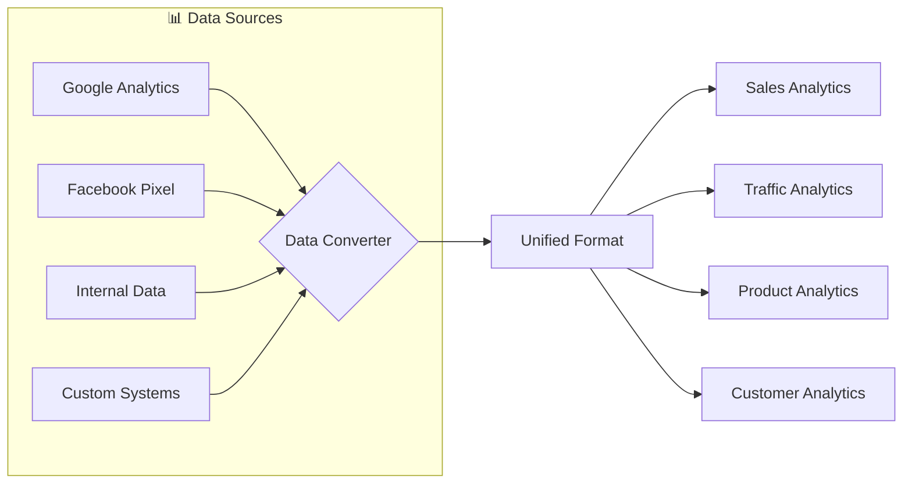
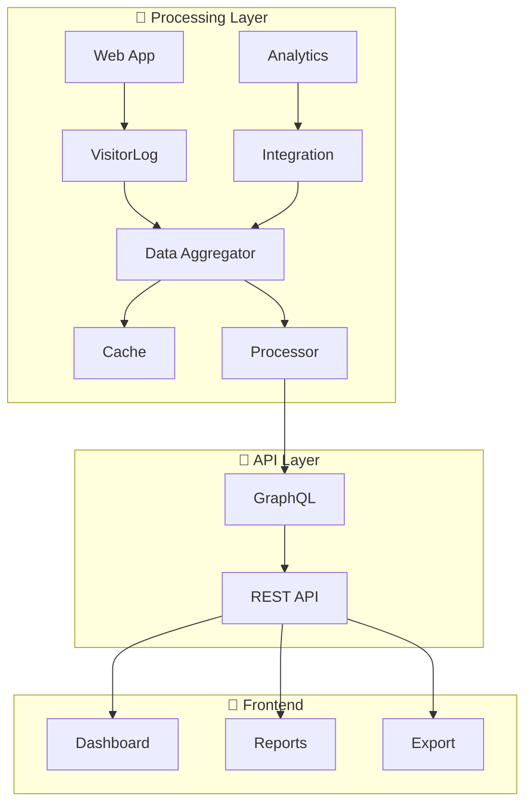

  
  #  Ibrahim (Mark) Al-Asfar
  
  **`Senior Full-Stack Developer | Systems Architect | AI & Fintech Builder`**
  
  
  
  
  
  
  

---

  

---

  

---

  
  
<i>🔥 Total profile views since 2024</i>

---

  
  

---

## 🚀 About Me

I'm a **Senior Full-Stack Developer & Systems Architect** with 5+ years of experience building enterprise-grade platforms from the ground up.

<table>
  <tr>
    <td>
      <ul>
        <li>🔭 Founder of <strong>MGzon</strong> – Comprehensive ERP ecosystem (10,000+ users)</li>
        <li>🌱 Currently learning <strong>Kubernetes, GraphQL, Advanced System Design</strong></li>
        <li>👯 Looking to collaborate on <strong>Open Source & innovative web apps</strong></li>
        <li>💬 Ask me about <strong>Node.js, React, System Architecture, or Fintech</strong></li>
        <li>⚡ Fun fact: <strong>Built an inheritance system just to avoid Excel</strong> 😂</li>
        <li>🐧 Linux-first developer | Terminal enthusiast</li>
      </ul>
    </td>
    <td align="center">
      
    </td>
  </tr>
</table>

---

## 🧠 My Architecture Philosophy

---

## 🛠️ Tech Stack

### 🎨 Frontend

### ⚙️ Backend

### 🗄️ Database & DevOps

### 🔧 Tools & Cloud

---

## 📂 Featured Projects

| Project | Description | Tech Stack |
|---------|-------------|------------|
| **[MGzon](https://mgzon-mgzon-app.hf.space/)** | Enterprise ERP Platform with fintech, e-commerce, HR, inheritance systems | Node.js, React, MongoDB, Redis, Docker |
| **[Hager-Zon](https://hager-zon.vercel.app/)** | Modern e-commerce platform | Next.js, TypeScript, Tailwind |
| **[My Next.js Project](https://github.com/Mark-Lasfar/my-nextjs-project)** | Full-stack Next.js boilerplate | Next.js 14, TypeScript, Prisma |

---

## 📊 GitHub Stats

  
  

---

  

---

## 📊 Dynamic GitHub Metrics

  
    **🔄 Come back later... things change around here 🔄**

  
  
  

---

## 📫 Connect With Me

  
| Platform | Link |
|----------|------|
| 📧 Email | [marklasfar@gmail.com](mailto:marklasfar@gmail.com) |
| 💼 LinkedIn | [Mark Al-Asfar](https://linkedin.com/in/mark-alasfar) |
| 🌐 Portfolio | [mgzon-server.hf.space](https://mgzon-server.hf.space) |
| 📄 CV | [Download PDF](https://drive.google.com/file/d/1-wr3dvpYtgAgAY9lc7pva_Dohoy9IdMk/view) |
| 🐙 GitHub | [Mark-Lasfar](https://github.com/Mark-Lasfar) |

---

  
  ### ⚡ "Terminal-first developer | Linux enthusiast | Building systems that matter"
  
  **⭐ If you like my work, consider giving a star to my repositories ⭐**
  

